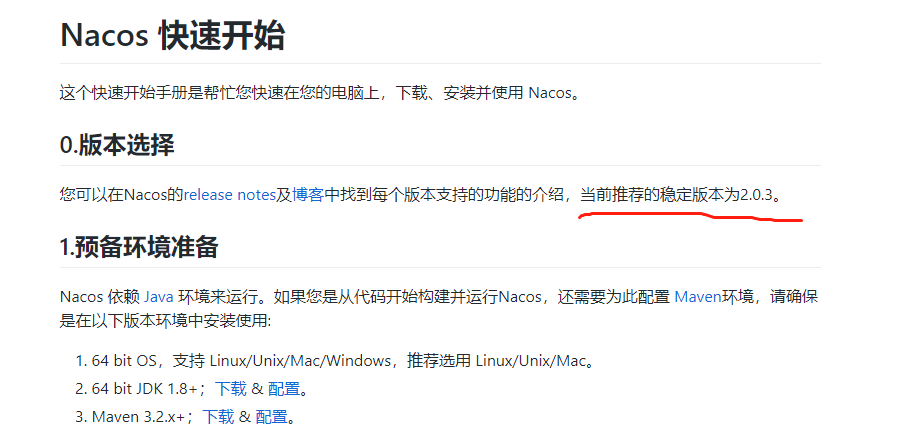
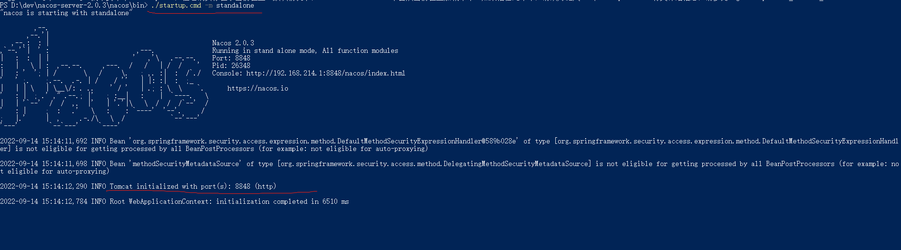
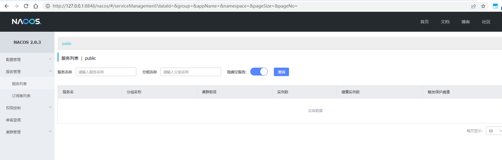
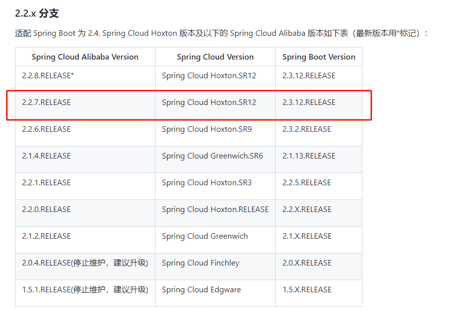
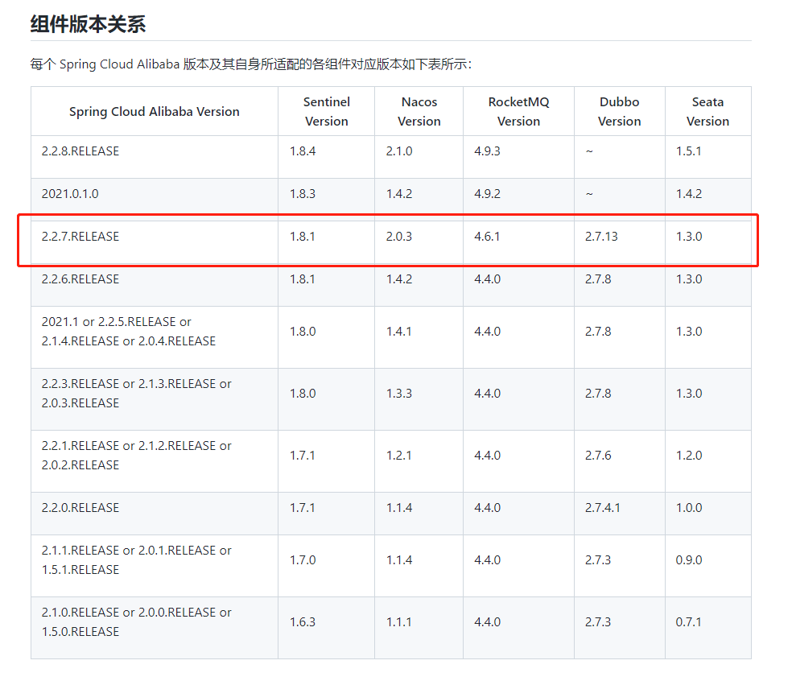
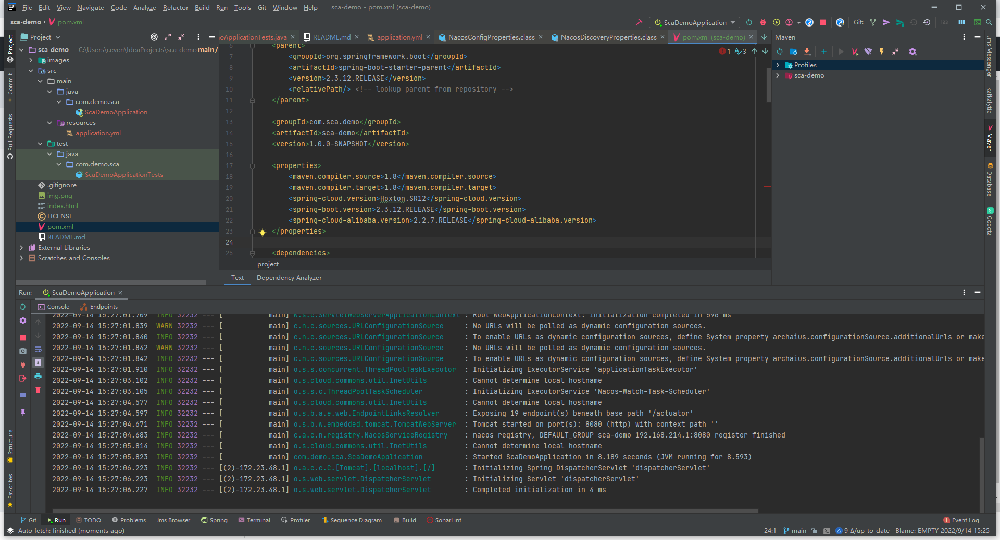
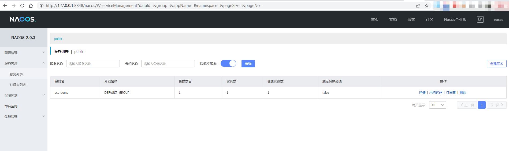

# sca-demo
1. using SpringCloud (Hoxton.SR12)+Springboot(2.3.12.RELEASE)+Spring Cloud Alibaba(2.2.7.RELEASE) to create a spring cloud project.
2. using spring-cloud-starter-alibaba-nacos-discovery.
3. start the project.
4. See error.

## Which issue related ?

https://github.com/alibaba/spring-cloud-alibaba/issues/2761

## Nacos 2.0.3

https://github.com/alibaba/nacos/releases

3.启动服务器
Windows
启动命令(standalone代表着单机模式运行，非集群模式):

startup.cmd -m standalone

http://127.0.0.1:8848/nacos/

## 版本依赖关系

详情参考：
https://github.com/alibaba/spring-cloud-alibaba/wiki/%E7%89%88%E6%9C%AC%E8%AF%B4%E6%98%8E

## The result
Every thing is ok.

